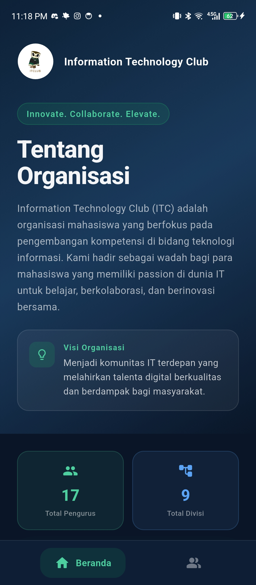
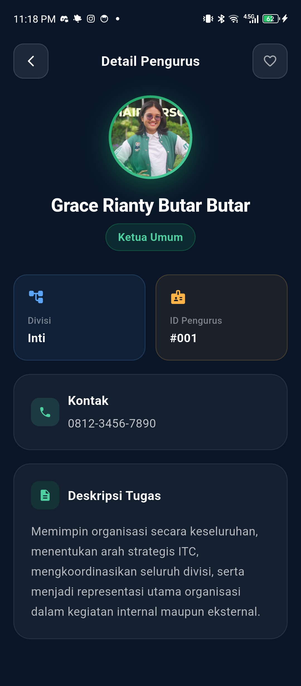

# ITC Directory

A Flutter mobile application for viewing organization structures digitally in a clean and modern interface.

---

# Features

- View organization profile
- View divisions and departments
- View member information
- Clean and responsive UI
- Multi-platform Flutter support

---

# Tech Stack

- Flutter
- Dart
- Material Design

---

# Project Structure

```plaintext
lib/
 ├── controllers/
 ├── models/
 ├── views/
 └── main.dart
```

---

# Screenshots

## Home Screen



---

## Organization Detail



---

## Member List


---

# How to Run the Flutter Application

## 1. Clone Repository

```bash
git clone https://github.com/YOUR_USERNAME/YOUR_REPOSITORY.git
```

---

## 2. Move Into Project Folder

```bash
cd YOUR_REPOSITORY
```

---

## 3. Install Dependencies

```bash
flutter pub get
```

---

## 4. Check Connected Devices

```bash
flutter devices
```

---

## 5. Run the Application

```bash
flutter run
```

---

# Requirements

- Flutter SDK
- Dart SDK
- Android Studio or VS Code
- Android device or emulator

---

# Installation Reference

Official Flutter documentation:

https://docs.flutter.dev/get-started/install

---

# Author

Ariel

---